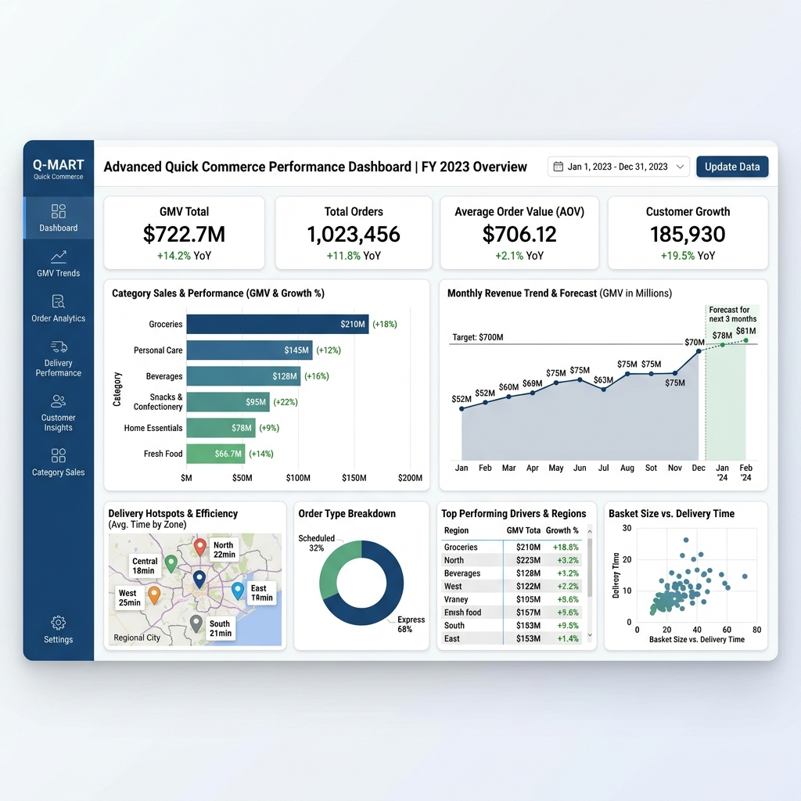

# InstaAnalytics: Production-Grade Power BI & SQL Data Science for Quick-Commerce ⚡

InstaAnalytics is a production-ready, high-performance analytical pipeline and interactive control center designed for Quick-Commerce platforms (such as Blinkit, Swiggy Instamart, and Zepto). 

This project showcases end-to-end database design, data simulation at scale (1M+ orders, 5M+ line items), advanced SQL optimization, and interactive dashboarding using **Power BI** (and local Streamlit fallback).



---

## 🏗️ Project Architecture

```
User (Executive / Analyst) ──> Power BI Dashboard (real-time visual layer)
                                      │
                                      ▼
                        DirectQuery Connection (.pbids) ──> PostgreSQL (Production Replica)
                                                            └─> SQLite (Local Cache Fallback)
```

1. **Transaction Simulation**: High-speed, vectorized synthetic data generator modeling real-world user cohorts, repeat buyers (Zipf's law), temporal seasonality (weekends, hours), and regional holiday events.
2. **Database DDL**: PostgreSQL schema with range partitioning on transaction timestamps and query-tuned indexes.
3. **Advanced SQL Portfolio**: 100 complex SQL queries answering core analytical questions (Cohort retention, RFM models, CLV, inventory DIO, and logistics SLA compliance).
4. **Power BI Dashboard Integration**: Detailed connection mappings using direct data source files (.pbids) and custom DAX (Data Analysis Expressions) measures.

---

## 📁 Repository Structure

```text
CoinMainProj/
├── dashboard/
│   ├── app.py                  # Streamlit Dashboard (Local Python Fallback)
│   ├── db.py                   # Dynamic PG/SQLite DB Connector
│   └── views/                  # Streamlit Views Folder
├── quick_commerce_connection.pbids # Power BI Data Source Connection File
├── powerbi_guide.md            # Step-by-step Power BI Integration & DAX Guide
├── powerbi_screenshot.png      # Power BI Dashboard Visual Interface Preview
├── schema.sql                  # PostgreSQL Database DDL
├── advanced_analytics_queries.sql # Portfolio of 100 Advanced Analytics Queries
├── generate_data_sql_adv.py    # Vectorized 1M-Order Simulator
└── README.md                   # Project Overview
```

---

## 📊 Database Metrics (Actual Computed Outputs)
* **Total GMV (Delivered Orders):** `$722,700,467.37`
* **Delivered Orders Volume:** `940,009` (94% fulfillment rate)
* **Dark Store Hub Count:** `100` stores
* **Unique SKU Items Count:** `5,000` SKUs
* **Customer Base:** `100,000` unique users

---

## 📊 Power BI Setup & Local Quickstart

### 1. Launch Power BI
Double-click [quick_commerce_connection.pbids](quick_commerce_connection.pbids) to configure the data connection. Learn more about the DAX measures used to compute the KPIs in the [Power BI Guide](powerbi_guide.md).

### 2. Set Up Local SQLite Database
To recreate the simulated database:
```bash
pip install -r dashboard/requirements.txt
python generate_data_sql_adv.py
python load_and_validate.py
```
