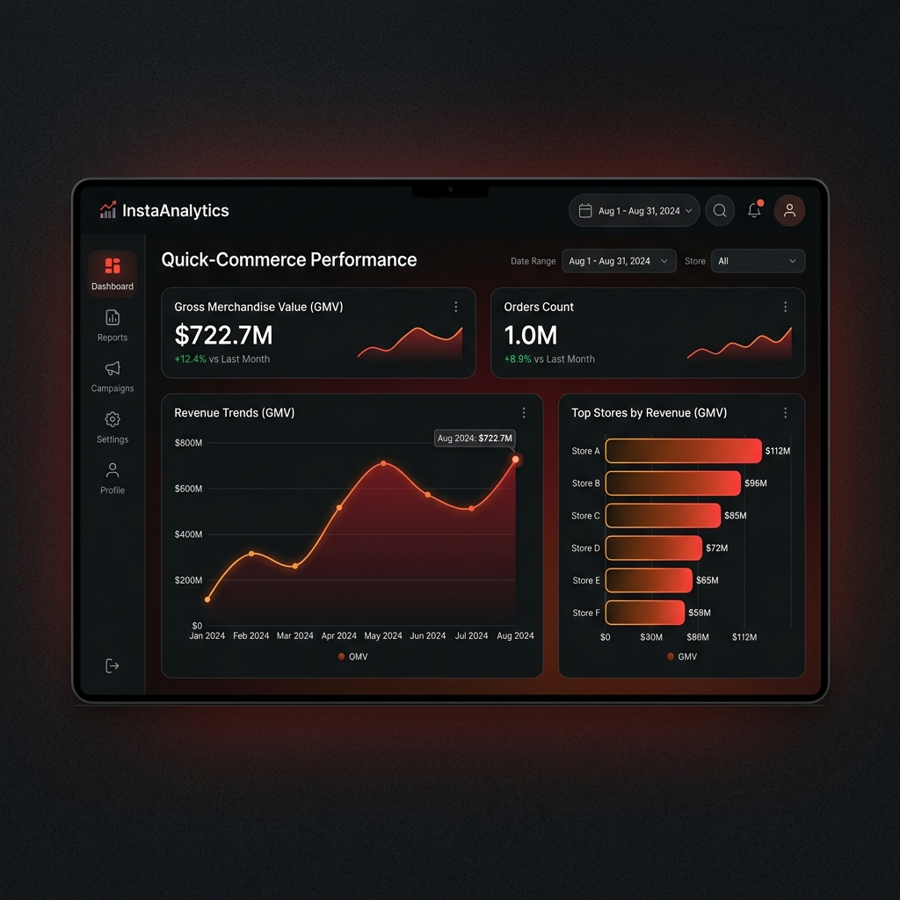

# InstaAnalytics: Production-Grade AI Data Scientist for Quick-Commerce ⚡

InstaAnalytics is a production-ready, high-performance analytical pipeline and interactive control center designed for Quick-Commerce platforms (such as Blinkit, Swiggy Instamart, and Zepto). 

This project showcases end-to-end database design, data simulation at scale (1M+ orders, 5M+ line items), advanced SQL optimization, and a Streamlit executive dashboard.



---

## 🏗️ Project Architecture

```
User (Executive / Analyst) ──> Streamlit Control Center (dashboard/)
                                      │
                                      ▼
                        Data Connector (db.py) ──> PostgreSQL (Production Replica)
                                                   └─> SQLite (Local Cache Fallback)
```

1. **Transaction Simulation**: High-speed, vectorized synthetic data generator modeling real-world user cohorts, repeat buyers (Zipf's law), temporal seasonality (weekends, hours), and regional holiday events.
2. **Database DDL**: PostgreSQL schema with range partitioning on transaction timestamps and query-tuned indexes.
3. **Advanced SQL Portfolio**: 100 complex SQL queries answering core analytical questions (Cohort retention, RFM models, CLV, inventory DIO, and logistics SLA compliance).
4. **Analytics Interface**: Multipage Streamlit application connecting directly to the database displaying metrics across Revenue, Customers, and Inventory views.

---

## 📁 Repository Structure

```text
CoinMainProj/
├── dashboard/
│   ├── app.py                  # Streamlit Main App & Sidebar Navigation
│   ├── db.py                   # Dynamic PG/SQLite DB Connector
│   ├── requirements.txt        # Streamlit App Dependencies
│   └── views/
│       ├── revenue.py          # Sales Velocity, GMV, and Store KPIs
│       ├── customers.py        # Cohort Curves, Customer Tiers, LTV
│       └── inventory.py        # Out-of-Stock Rates and Replenishments
├── schema.sql                  # PostgreSQL Database DDL
├── advanced_analytics_queries.sql # Portfolio of 100 Advanced Analytics Queries
├── generate_data_sql_adv.py    # Vectorized 1M-Order Simulator
└── dashboard_screenshot.png    # Dashboard Interface Preview
```

---

## 📊 Database Metrics (Actual Computed Outputs)
* **Total GMV (Delivered Orders):** `$722,700,467.37`
* **Delivered Orders Volume:** `940,009` (94% fulfillment rate)
* **Dark Store Hub Count:** `100` stores
* **Unique SKU Items Count:** `5,000` SKUs
* **Customer Base:** `100,000` unique users

---

## 🛠️ Local Quickstart

### 1. Clone & Set Up Directory
```bash
git clone <your-repository-url>
cd CoinMainProj
```

### 2. Install Dependencies
```bash
pip install -r dashboard/requirements.txt
```

### 3. Generate Simulated Datasets (1M Orders)
To recreate the database and simulate the logs in a local SQLite file:
```bash
python generate_data_sql_adv.py
python load_and_validate.py
```

### 4. Start the Streamlit Dashboard
```bash
streamlit run dashboard/app.py
```
This starts the dashboard at **`http://localhost:8501`**.
